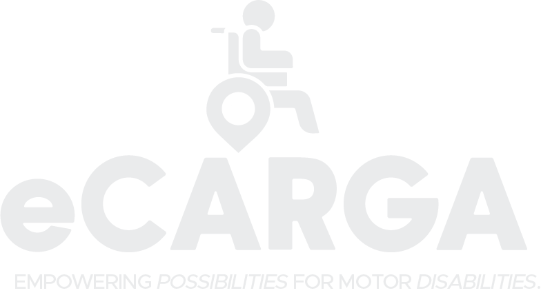

<!-- PROJECT LOGO -->
 

  

  

    A ride-hailing platform exclusively designed for people  with mobility disabilities and physical impairments.
     

<!-- TABLE OF CONTENTS -->

  
<h2 style="display: inline-block">Table of Contents</h2>

  <ol>
    <li>
      <a href="#about-the-project">About The Project</a>
      <ul>
        <li><a href="#built-with">Built With</a></li>
      </ul>
    </li>
    <li>
      <a href="#getting-started">Getting Started</a>
      <ul>
        <li><a href="#prerequisites">Prerequisites</a></li>
        <li><a href="#installation">Installation</a></li>
      </ul>
    </li>
    <li><a href="#roadmap">Contact the Team</a></li>
  </ol>

<!-- ABOUT THE PROJECT -->

## ℹ️ About The Project

This repository contains the project entry made for the GDSC PLM Innolympics 2024 

It is made using flutter, firebase, and Google Maps API.

## 🆕 Getting Started

- ### **Prerequisites**

  - Android SDK 21 and up

<!-- GETTING STARTED -->

- ### **Installation**

  In order to install the project, allow the permission to install from unkown sources, and then enable location.

<!-- CONTACT -->

## 👤 Contact Our Team

**Kangkong Chipset**

- Angelo Reyes: [@glo](https://www.facebook.com/profile.php?id=100060899045243)
- Dennis Layson Jr.: [@rambunctious](https://www.facebook.com/dennis.rambunctious)
- Lauvigne Lumeda: [@yuyuhei](https://www.facebook.com/lauvigne.lumeda)
- Vincent Ferrer: [@vinny](https://www.facebook.com/vinneeeey/)
